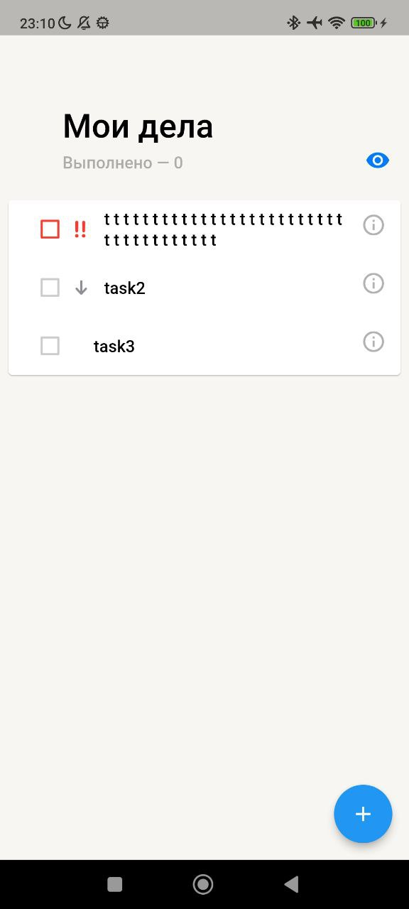
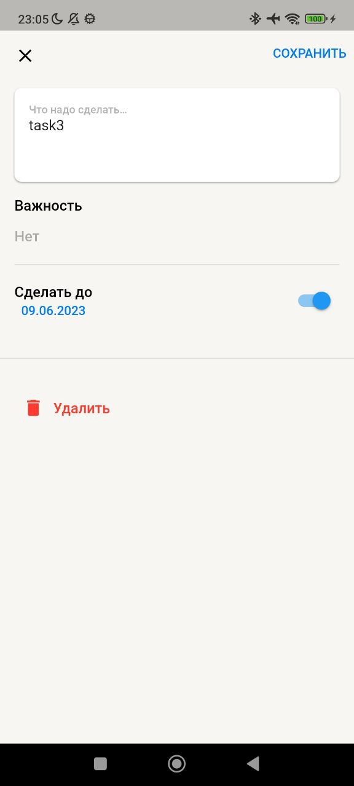
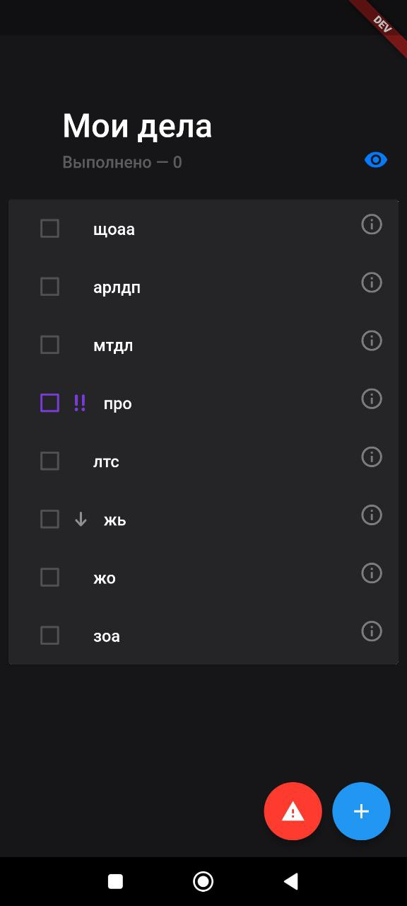
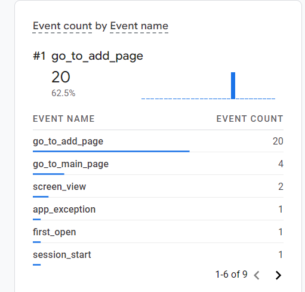

# TODO
Приложение для отслеживания важих задач

## Два экрана:
1. со списком задач: 
  - можно свайпать задачи для удаления или пометки выполнено
  - отмечать галочкой выполнение
  - возможность скрыть завершенные
  - отображение количесва завершенных задач
  - по клику на задачу, переход на экран редактирования
  - по клику на кнопку снизу, переход на экран добавления
  - анимированая шапка

    
2. экран с изменением/добавлением задачи
  - редактирование различных пунктов задачи(Имя, Приоритет, Срок выполнения)
  - нельзя добавить или изменить на пустое имя задачи
  - нельзя удалить, если задача добавляется(кнопка становится не активной)
  - можно сохранить или вернуться на предыдущий экран

    

## Чистота кода и общая структура проекта:
 - Используется flutter_lints, форматирование кода
 - Код разбит на слои(layer-first подход)

## Навигация, UI, animations:
 - отдельная сущность для навигации с доступом через GetIt
 - корректные отрисовка и поддержка экранов

## Firebase:
 - оба пункта реализованы, как удобно проверить, не знаю, можно мне написать в тг @PiggyJesus
 
 
 

## Build & Release:
 - Поддержаны 2 требуемых флейвора:
 1. разные сборки(в том числе и для тестов)
 2. справа сверху флажок
 3. кнопка, вызывающая ошибку в тест и дев версиях
 
 - CI на GitHub корректно работает(форматирование, линтер, тесты, сборка)
 - распространение через сервис вроде Firebase App Distribution, можно записаться [тестером](https://appdistribution.firebase.dev/i/38322a18059405f8)

## Разное:
 - Используется Google Analytics for Firebase

 

 - Используется freezed
 
 
 
## диплинки(только Android):
 - чтобы использовать, следует прописать в консоль 
 ```
 adb shell am start -W -a android.intent.action.VIEW -d myapp://todo/<PATH>
 ```
 - главный экран: 
 ```
 adb shell am start -W -a android.intent.action.VIEW -d myapp://todo/
 ```
 - экран с новой задачей:
 ```
 adb shell am start -W -a android.intent.action.VIEW -d myapp://todo/edit_page/
 ```
 - экран редактирования:
 ```
 adb shell am start -W -a android.intent.action.VIEW -d myapp://todo/edit_page/edit_page/<uuid>
 ```
 - при неправильном пути откроется страница добавления
 - если команда adb не находится, следует перейти в директорию <...>\Android\Sdk\platform-tools\
