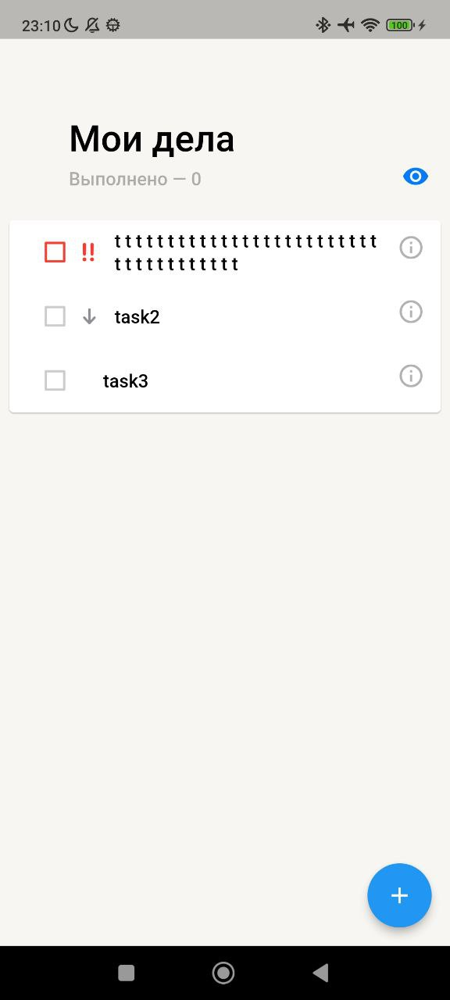
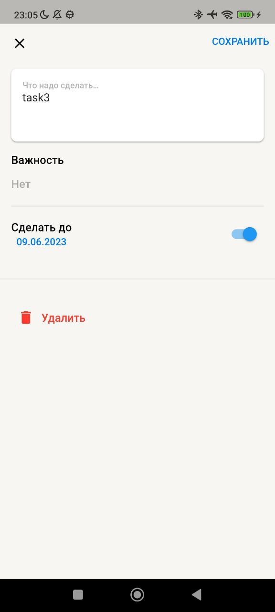

# TODO
Приложение для отслеживания важих задач

[Ссылка на билд](https://disk.yandex.ru/d/IRZbcA33etA03w)

## Запуск:
 - в [поле bearerKey](lib\core\utils\my_strings.dart) записать свой токен

## Два экрана:
1. со списком задач: 
  - можно свайпать задачи для удаления или пометки выполнено
  - отмечать галочкой выполнение
  - возможность скрыть завершенные
  - отображение количесва завершенных задач
  - по клику на задачу, переход на экран редактирования
  - по клику на кнопку снизу, переход на экран добавления
  - анимированая шапка

    
2. экран с изменением/добавлением задачи
  - редактирование различных пунктов задачи(Имя, Приоритет, Срок выполнения)
  - нельзя добавить или изменить на пустое имя задачи
  - нельзя удалить, если задача добавляется(кнопка становится не активной)
  - можно сохранить или вернуться на предыдущий экран

    

## Чистота кода и общая структура проекта:
 - Используется flutter_lints, форматирование кода
 - Код разбит на слои(layer-first подход)

## Получение и хранение данных:
 - обрабатываются ошибки, связанные с запросами и доступом к бекенду
 - без интернета данные храняться в локальном репозитории, 
 при появлении соединения происходит Merge и данные обновляются

## Architecture:
 - работа с данными организованна в директории data, и разбита на несколько слоев
 - используются [Isar](https://pub.dev/packages/isar) для локального хранилища, [Dio](https://pub.dev/packages/dio) для доступа к бекенду
 - State-management реализован с использованием [flutter_bloc](https://pub.dev/packages/flutter_bloc)
 - DI реализован с помощью [get_it](https://pub.dev/packages/get_it)

## Testing:
 - Реализованны тесты к TaskModel

## Deeplinks:
 - Приложение перенесено на Navigator 2.0, с помощью него реализованы диплинки(только Android)
 - чтобы использовать, следует прописать в консоль 
 ```
 adb shell am start -W -a android.intent.action.VIEW -d myapp://todo/<PATH>
 ```
 - главный экран: 
 ```
 adb shell am start -W -a android.intent.action.VIEW -d myapp://todo/
 ```
 - экран с новой задачей:
 ```
 adb shell am start -W -a android.intent.action.VIEW -d myapp://todo/edit_page/
 ```
 - экран редактирования:
 ```
 adb shell am start -W -a android.intent.action.VIEW -d myapp://todo/edit_page/edit_page/<uuid>
 ```
 - при неправильном пути откроется UnknownPage
 - если команда adb не находится, следует перейти в директорию <...>\Android\Sdk\platform-tools\
